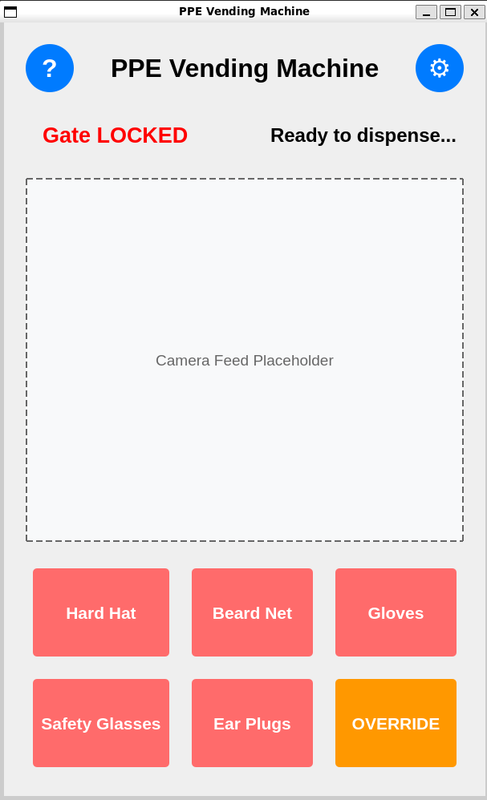
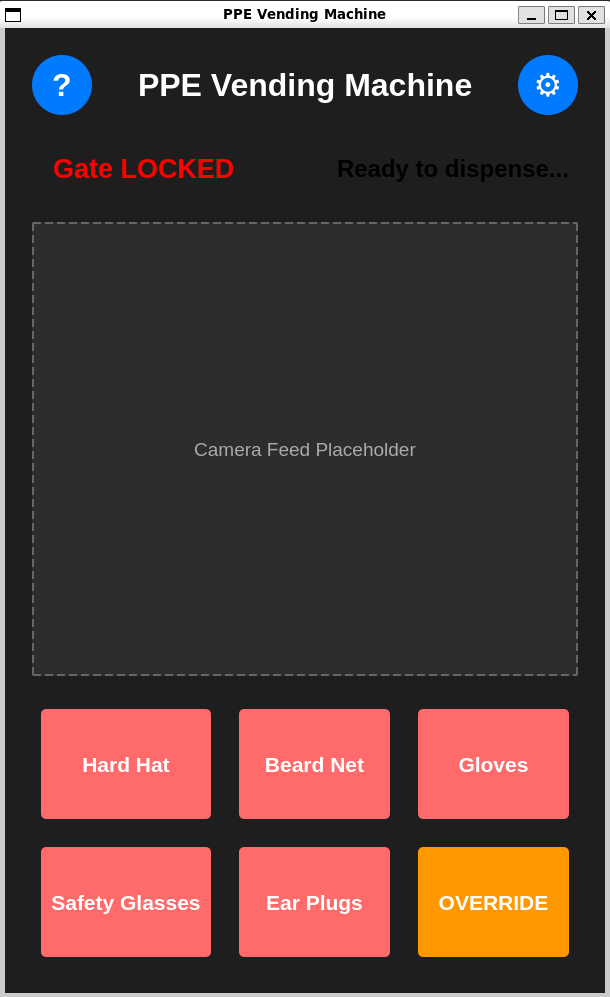
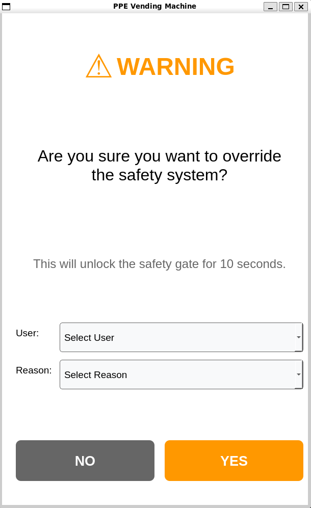
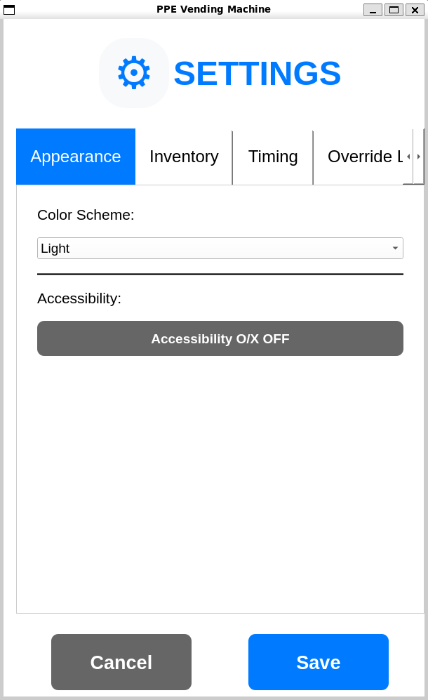
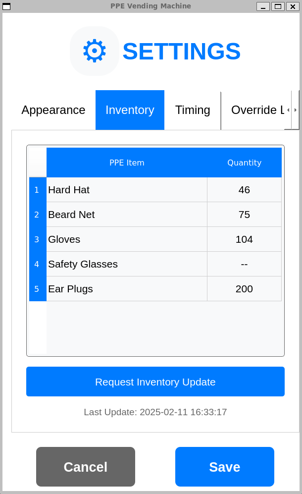
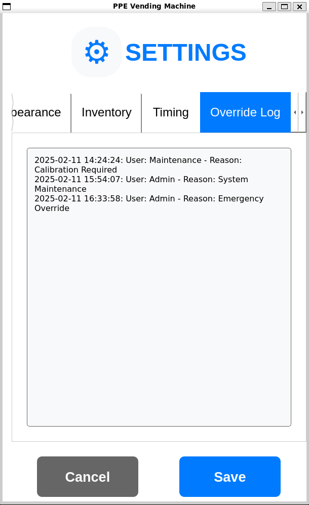
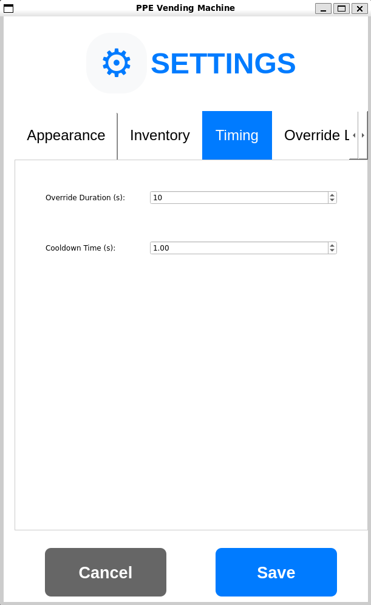

# GUI Package for PPE Vending Machine


A ROS2 package containing a PyQt5-based graphical user interface for controlling and monitoring a PPE (Personal Protective Equipment) vending machine.

## Features

### Core Features
- Real-time PPE detection status monitoring display
- Automated safety gate control logic
- ROS2 integration for interface with vending machine hardware and computer vision model
- Administrative override system
- Simulation support for testing
- Optomized for touch screen use

### Latest Major Features (v0.5.0)
- Modular code architecture with improved maintainability
- Integrated inventory management system
- Real-time inventory tracking and updates
- Inventory request and response system
- Improved settings interface with tabbed organization
- Improved override system with user tracking and reason logging
- Improved override content UI

### Accessibility Features
- Toggle for O/X status indicators, for users with visual impairments
- Clear text labels
- Screen reader friendly layout

### Update Changelog

For a detailed list of changes, bug fixes, and new features, please refer to the [CHANGELOG](CHANGELOG.md).

## Dependencies

- ROS2 Humble
- Python 3.10+
- PyQt5 5.15+
- rclpy
- std_msgs

## Installation

1. Create a ROS2 workspace (if you don't have one):
```bash
mkdir -p ~/ros2_ws/src
cd ~/ros2_ws
```

2. Clone this package:
```bash
cd src
git clone https://github.com/ckyb63/ppe_gui_package.git
```

3. Install dependencies:
```bash
sudo apt update
sudo apt install python3-pyqt5
```

4. Build and source:
```bash
cd ~/ros2_ws
colcon build
source install/setup.bash
```

## Usage

### Running the GUI

```bash
# Launch the main GUI
ros2 launch gui_package main_ppe_gui.launch.py

# Run the dummy inventory publisher
ros2 run gui_package dummy_inventory

# For testing without hardware
ros2 run gui_package dummy_ppe

# For testing both dummy nodes
ros2 launch gui_package dummy_nodes.launch.py
```

## ROS2 Topics

### Subscribed Topics
- `ppe_status` (std_msgs/String): Receives PPE detection status
  - Format: "hardhat:true, beardnet:false, gloves:true, glasses:true, earplugs:false"
- `ppeInventoryStatus` (std_msgs/String): Receives inventory status updates
  - Format: JSON string with inventory levels

### Published Topics
- `pleaseDispense` (std_msgs/String): Sends dispense requests
  - Values: "hardhat", "beardnet", "gloves", "glasses", "earplugs", "OVERRIDE"
- `gate` (std_msgs/Bool): Controls safety gate status
  - true = locked, false = unlocked
- `ppeInventory` (std_msgs/String): Sends inventory update requests
  - Value: "request"

## Development

### File Structure
```
├── CHANGELOG.md
├── docs
│   └── images >> (screenshots)
├── gui_package
│   ├── dummy_test
│   │   ├── dummy_inventory_publisher.py
│   │   ├── dummy_ppe_status.py
│   │   └── __init__.py
│   ├── __init__.py
│   ├── launch
│   └── main_gui_modules
│       ├── __init__.py
│       ├── main.py
│       ├── main_window.py
│       ├── README.md
│       ├── ros_node.py
│       ├── utils
│       │   ├── colors.py
│       │   ├── context.py
│       │   ├── __init__.py
│       │   └── logger.py
│       └── widgets
│           ├── buttons.py
│           ├── dialogs.py
│           ├── __init__.py
│           ├── override_dialog.py
│           ├── sections.py
│           └── settings_dialog.py
├── launch
│   ├── dummy_nodes.launch.py
│   └── main_ppe_gui.launch.py
├── override_log.json
├── package.xml
├── README.md
├── resource
│   └── gui_package
├── setup.cfg
├── setup.py
└── test >> (default test files)
```

### Building for Development
```bash
cd ~/ros2_ws
colcon build --packages-select gui_package --symlink-install
```

## Author

- Max Chen
- Email: ckyb63@gmail.com

## Screenshots

<details>
<summary>Main Interface</summary>

<table>
<tr>
    <td width="50%"></td>
    <td width="50%"></td>
</tr>
<tr>
    <td><em>Standard interface with PPE status indicators</em></td>
    <td><em>Dark theme with accessibility features</em></td>
</tr>
</table>

</details>

<details>
<summary>Override System</summary>



*Enhanced override dialog with user authentication and reason tracking*

</details>

<details>
<summary>Settings Interface</summary>

<table>
<tr>
    <td width="50%"></td>
    <td width="50%"></td>
</tr>
<tr>
    <td><em>Main settings configuration panel</em></td>
    <td><em>Inventory management settings</em></td>
</tr>
</table>

<table>
<tr>
    <td width="50%"></td>
    <td width="50%"></td>
</tr>
<tr>
    <td><em>Override logging and configuration</em></td>
    <td><em>System timing and delay settings</em></td>
</tr>
</table>

</details>

<details>
<summary>Help Documentation</summary>


*Comprehensive user help guide with feature explanations*

</details>