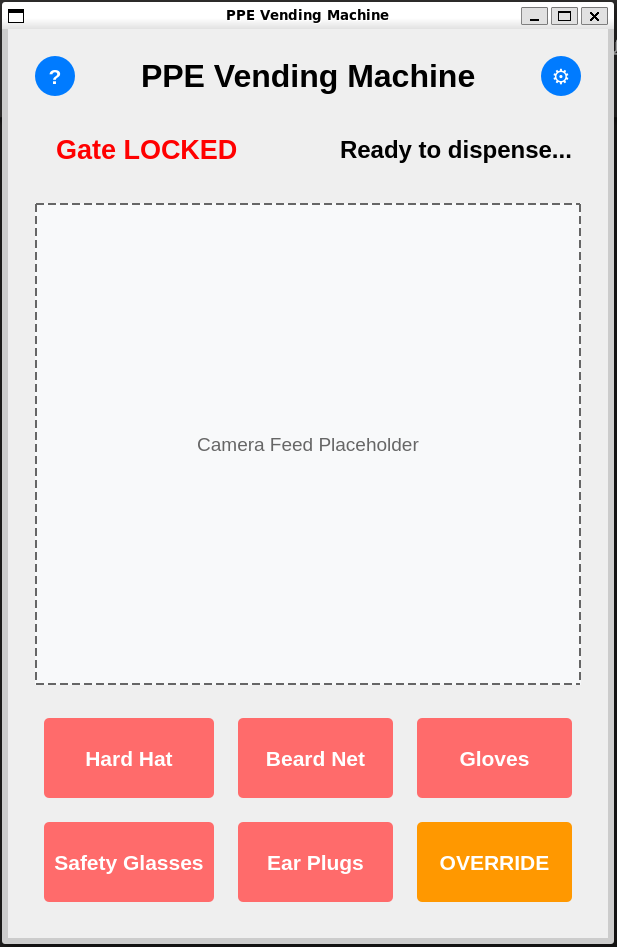
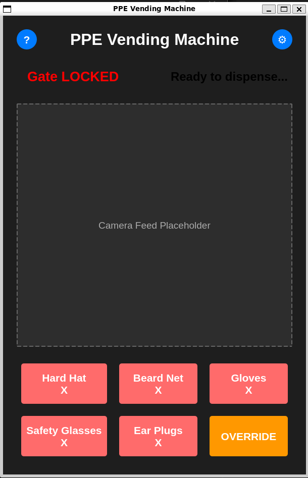
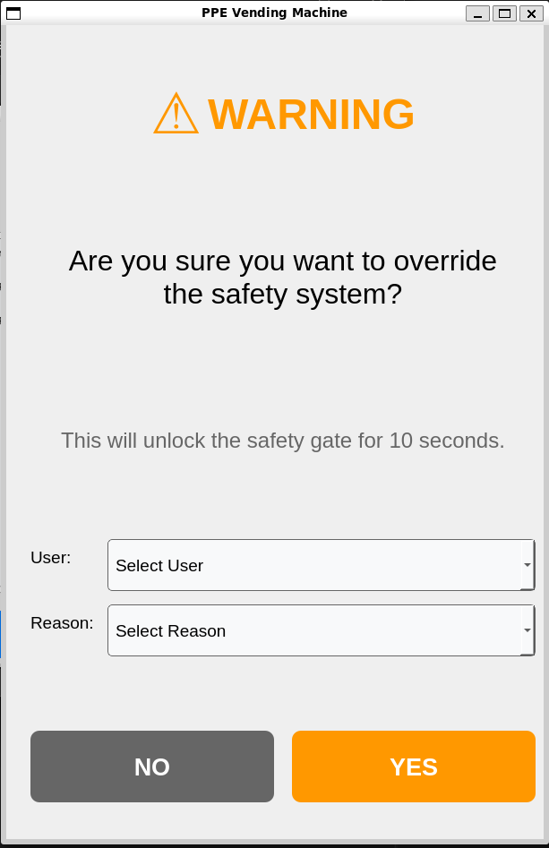
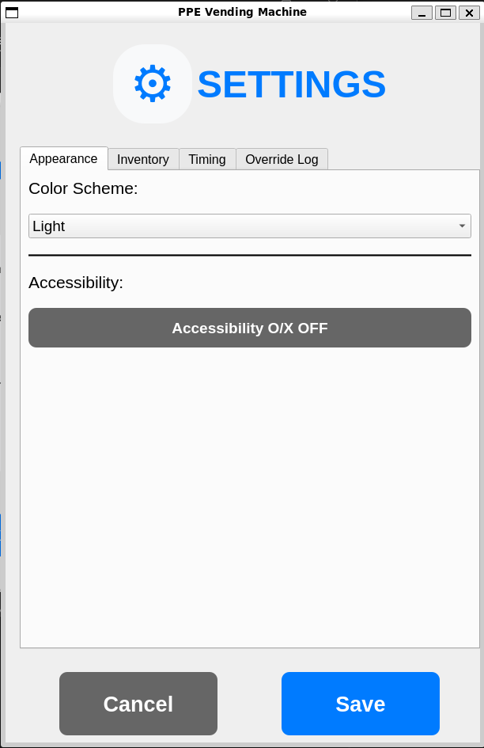
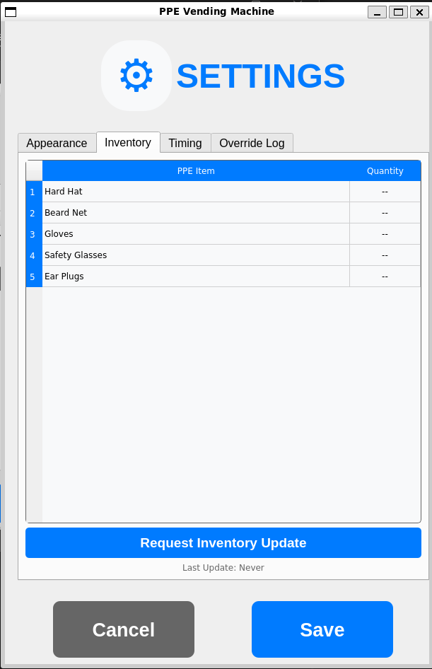
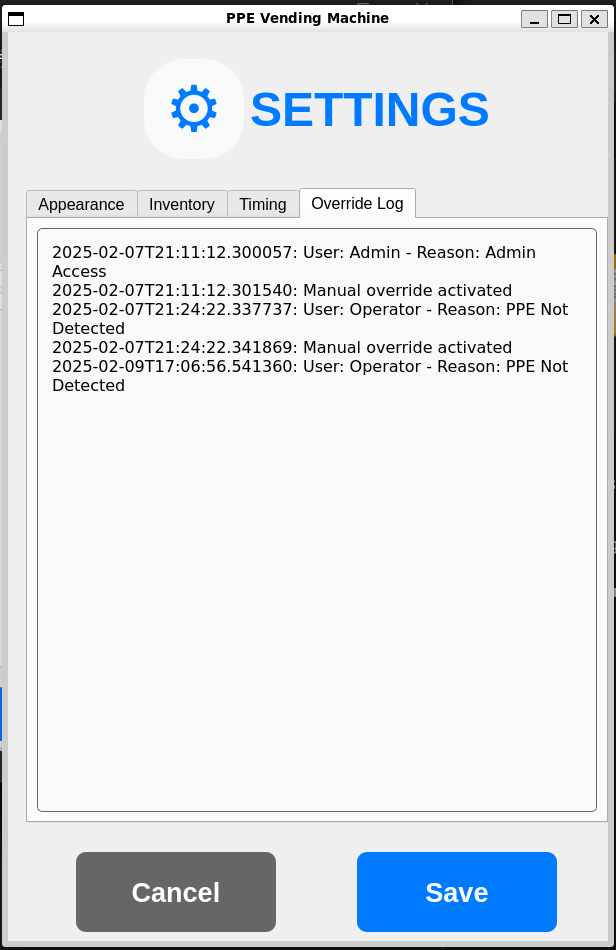
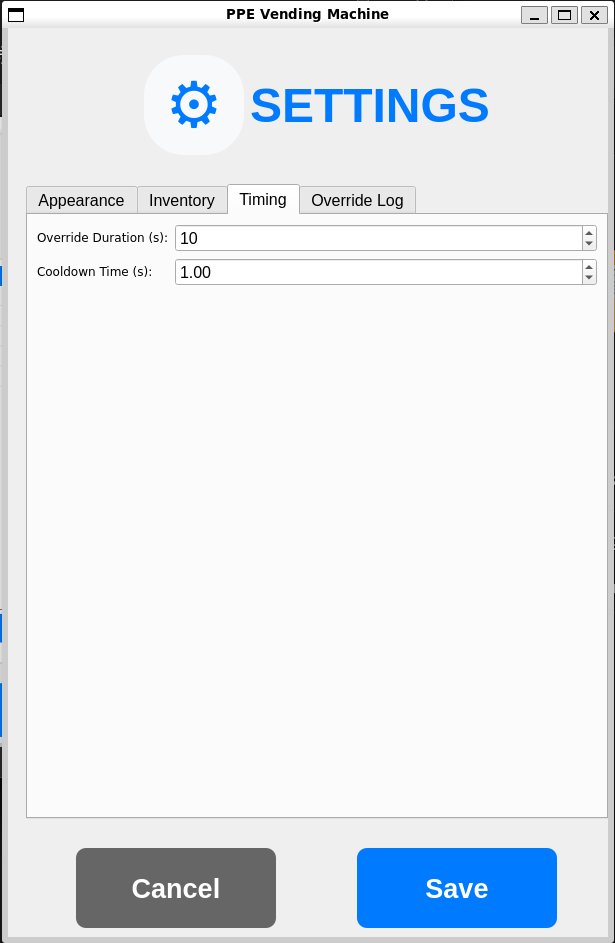
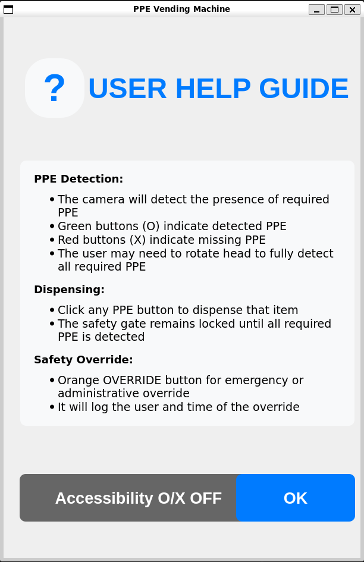

# GUI Package for PPE Vending Machine

## Version 0.5.0

A ROS2 package containing a PyQt5-based graphical user interface for controlling and monitoring a PPE (Personal Protective Equipment) vending machine.

## Features

### Core Features
- Real-time PPE detection status monitoring
- Automated safety gate control
- ROS2 integration for vending machine control
- Administrative override system
- Simulation support for testing

### Latest Features (v0.5.0)
- Modular code architecture with improved maintainability
- Integrated inventory management system
- Real-time inventory tracking and updates
- Inventory request and response system
- Improved settings interface with tabbed organization
- Improved override system with user tracking and reason logging
- Improved override content UI

### Previous Features (v0.3.1)
- Enhanced override system with user tracking and reason logging
- Added user authentication for overrides
- Detailed override logging with user and reason tracking
- Improved override dialog UI with dropdown selections

### Accessibility Features
- Toggle for O/X status indicators
- Clear text labels
- Consistent button sizing
- Screen reader friendly layout

## Dependencies

- ROS2 Humble
- Python 3.10+
- PyQt5 5.15+
- rclpy
- std_msgs

## Installation

1. Create a ROS2 workspace (if you don't have one):
```bash
mkdir -p ~/ros2_ws/src
cd ~/ros2_ws
```

2. Clone this package:
```bash
cd src
git clone https://github.com/ckyb63/ppe_gui_package.git
```

3. Install dependencies:
```bash
sudo apt update
sudo apt install python3-pyqt5
```

4. Build and source:
```bash
cd ~/ros2_ws
colcon build
source install/setup.bash
```

## Usage

### Running the GUI

```bash
# Launch the new modular main GUI (recommended)
ros2 launch gui_package experimental_gui.launch.py

# Run the experimental GUI (recommended)
ros2 run gui_package experimental_gui

# Run the dummy inventory publisher
ros2 run gui_package dummy_inventory

# For testing without hardware
ros2 run gui_package dummy_ppe

# Run the older main GUI (deprecated)
ros2 run gui_package ppe_gui
```

## ROS2 Topics

### Subscribed Topics
- `ppe_status` (std_msgs/String): Receives PPE detection status
  - Format: "hardhat:true, beardnet:false, gloves:true, glasses:true, earplugs:false"
- `ppeInventoryStatus` (std_msgs/String): Receives inventory status updates
  - Format: JSON string with inventory levels

### Published Topics
- `pleaseDispense` (std_msgs/String): Sends dispense requests
  - Values: "hardhat", "beardnet", "gloves", "glasses", "earplugs", "OVERRIDE"
- `gate` (std_msgs/Bool): Controls safety gate status
  - true = locked, false = unlocked
- `ppeInventory` (std_msgs/String): Sends inventory update requests
  - Value: "request"

## Development

### File Structure
```
├── gui_package
│   ├── experimental/
│   │   ├── utils/
│   │   │   ├── colors.py
│   │   │   ├── context.py
│   │   │   └── logger.py
│   │   ├── widgets/
│   │   │   ├── buttons.py
│   │   │   ├── sections.py
│   │   │   └── dialogs.py
│   │   ├── main.py
│   │   ├── main_window.py
│   │   └── ros_node.py
│   ├── dummy_ppe_status.py
│   ├── dummy_inventory_publisher.py
│   └── ppe_gui.py
├── launch/
│   └── experimental_gui.launch.py
├── package.xml
├── README.md
└── setup.py
```

### Building for Development
```bash
cd ~/ros2_ws
colcon build --packages-select gui_package --symlink-install
```

## Author

- Max Chen
- Email: ckyb63@gmail.com

## Screenshots

<details>
<summary>Main Interface</summary>

| Light Theme | Dark Theme |
|------------|------------|
|  |  |
| *Standard interface with PPE status indicators* | *Dark theme with accessibility features* |

</details>

<details>
<summary>Override System</summary>


*Enhanced override dialog with user authentication and reason tracking*

</details>

<details>
<summary>Settings Interface</summary>

| Settings Panel | Description |
|---------------|-------------|
|  | *Main settings configuration panel* |
|  | *Inventory management settings* |
|  | *Override logging and configuration* |
|  | *System timing and delay settings* |

</details>

<details>
<summary>Help Documentation</summary>


*Comprehensive user help guide with feature explanations*

</details>