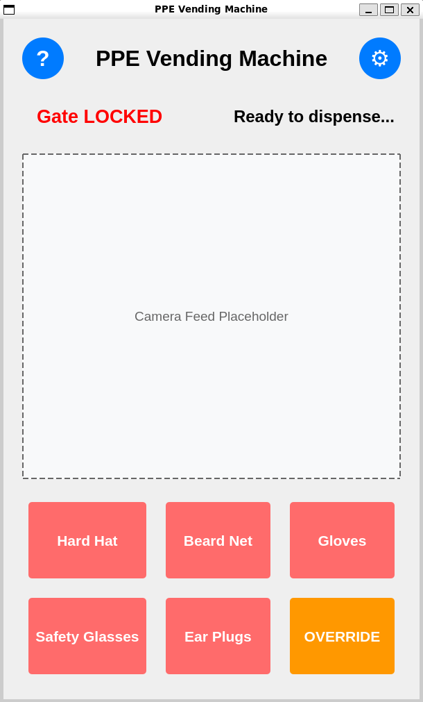
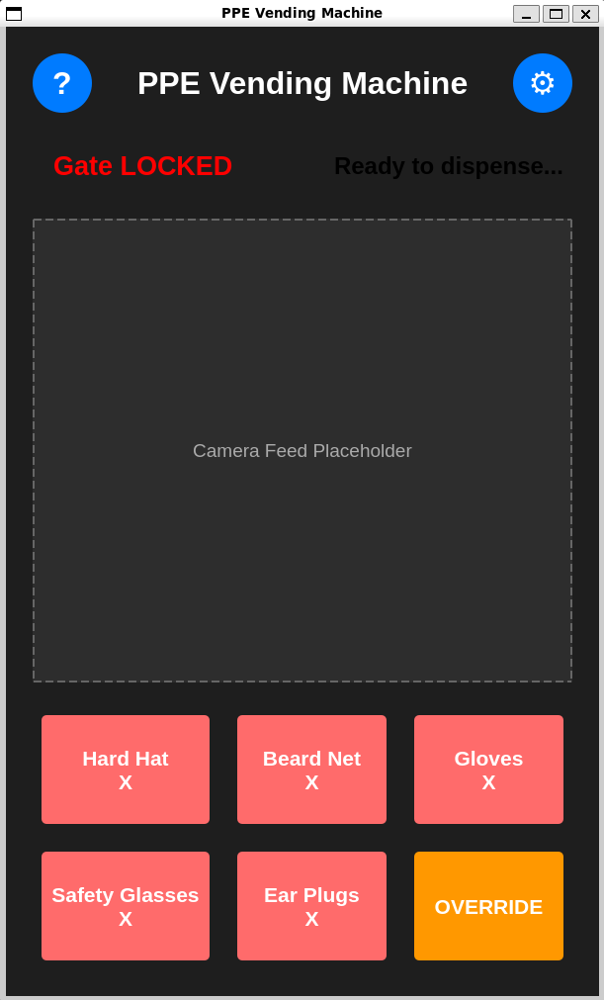
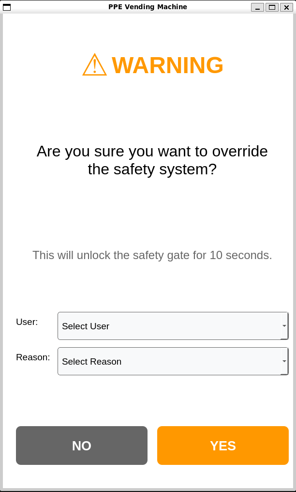
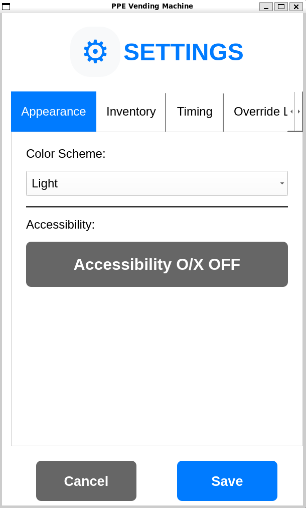
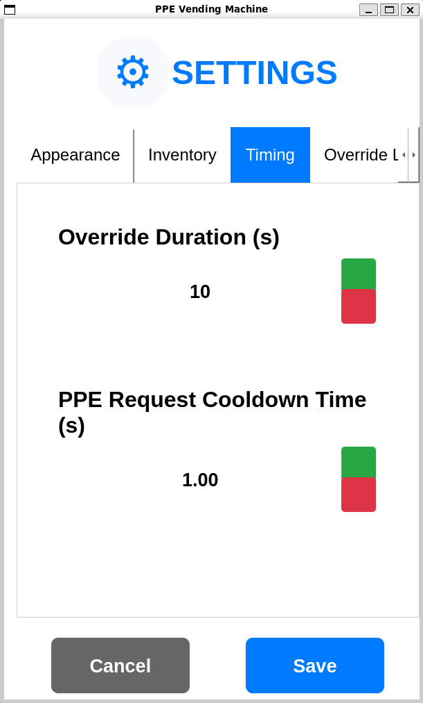
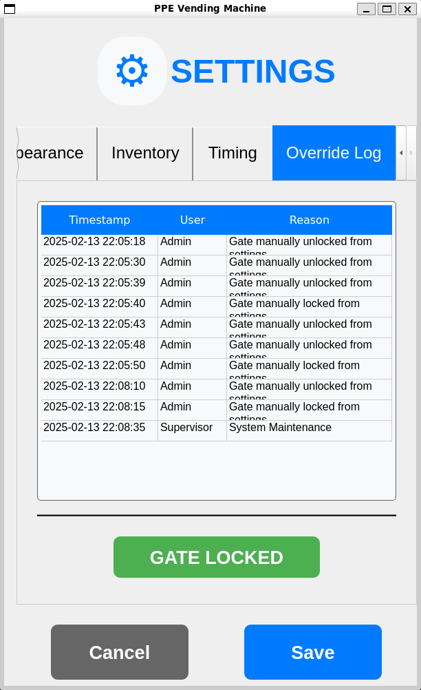
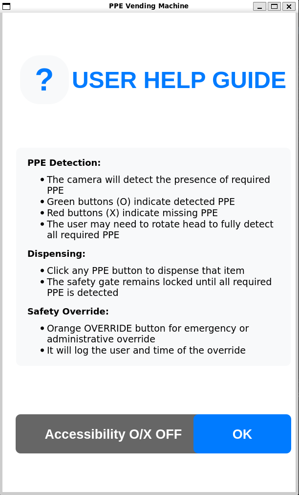

# GUI Package for PPE Vending Machine


A ROS2 package containing a PyQt5-based graphical user interface for controlling and monitoring a PPE (Personal Protective Equipment) vending machine.

## Features

### Core Features
- **Real-time PPE Detection**: Monitor PPE detection status in real-time for immediate feedback.
- **Automated Safety Gate Control**: Implement logic for automatic control of the safety gate.
- **ROS2 Integration**: Seamlessly interface with vending machine hardware and computer vision models using ROS2.
- **Safety Gate Override System**: Allow the safety gate to be overriden provided user and reason information.
- **Simulation Support**: Test nodes are provided to simulate and test the GUI for demonstrations.
- **Touchscreen Friendly**: GUI is developed with a touchscreen in mind with large touch targets and clear text labels.
- **ESP32 Safety Gate Controller**: A ESP32 microcontroller is used to control the safety gate.
- **Inventory Management**: Inventory is managed with a JSON file and can be viewed live from the GUI.
- **Theme Support**: The GUI supports a dark theme and a light theme.
- **Accessibility Features**: The GUI supports a toggle for O/X status indicators, for users with visual impairments.

### Future Features (Planned)
- **Camera Feed**: A camera feed will be added to the GUI to display the PPE detection in real-time.
- **User Authentication**: User authentication will be added to the GUI to allow for user specific settings and permissions.
- **Reporting and Analytics**: Reporting and analytics will be added to the GUI to allow for reporting and analytics on the PPE usage.

### Update Changelog
For a detailed list of changes, bug fixes, and new features, please refer to the [CHANGELOG](CHANGELOG.md).

## Dependencies

- ROS2 Humble
- Python 3.10+
- PyQt5 5.15+
- rclpy
- std_msgs

## Installation

1. Create a ROS2 workspace (if you don't have one):
    ```bash
    mkdir -p ~/ros2_ws/src
    cd ~/ros2_ws
    ```

2. Clone this package:
    ```bash
    cd src
    git clone https://github.com/ckyb63/ppe_gui_package.git
    ```

3. Install dependencies using `rosdep`:
    ```bash
    cd ~/ros2_ws
    rosdep install --from-paths src --ignore-src -r -y
    ```

4. Install additional dependencies:
    ```bash
    sudo apt update
    sudo apt install python3-pyqt5
    ```

5. Build and source the workspace:
    ```bash
    cd ~/ros2_ws
    colcon build
    source install/setup.bash
    ```

6. Run the GUI:
    ```bash
    ros2 launch gui_package main_ppe_gui.launch.py
    ```

## Usage

### Running the GUI

```bash
# Launch the main GUI
ros2 launch gui_package main_ppe_gui.launch.py

# Run the dummy inventory publisher
ros2 run gui_package dummy_inventory

# For testing without hardware
ros2 run gui_package dummy_ppe

# For testing both dummy nodes
ros2 launch gui_package dummy_nodes.launch.py

# For running with Demo Gate hardware (ESP32 connected with USB over Serial)
ros2 launch gui_package gate_demo.launch.py
```

## ROS2 Topics

### Subscribed Topics
- `ppe_status` (std_msgs/String): Receives PPE detection status
  - Format: "hardhat:true, beardnet:false, gloves:true, glasses:true, earplugs:false"
- `ppeInventoryStatus` (std_msgs/String): Receives inventory status updates
  - Format: JSON string with inventory levels

### Published Topics
- `pleaseDispense` (std_msgs/String): Sends dispense requests
  - Values: "hardhat", "beardnet", "gloves", "glasses", "earplugs", "OVERRIDE"
- `gate` (std_msgs/Bool): Controls safety gate status
  - true = locked, false = unlocked
- `ppeInventory` (std_msgs/String): Sends inventory update requests
  - Value: "request"

## Development

### File Structure
```
├── CHANGELOG.md
├── docs
│   └── images >> Images for the README
├── gate
│   ├── ESP32_Bluetooth_Comms
│   │   └── ESP32_Bluetooth_Comms.ino
│   ├── __init__.py
│   └── safety_gate_controller.py
├── gui_package
│   ├── dummy_test
│   │   ├── dummy_inventory_publisher.py
│   │   ├── dummy_ppe_status.py
│   │   └── __init__.py
│   ├── __init__.py
│   └── main_gui_modules
│       ├── camera_feed.py
│       ├── __init__.py
│       ├── jsonSupport >> JSON files for the inventory and override log
│       │   ├── inventory_data.json
│       │   └── override_log.json
│       ├── main.py >> Main entry point for the GUI
│       ├── main_window.py
│       ├── README.md
│       ├── ros_node.py
│       ├── utils
│       │   ├── colors.py
│       │   ├── context.py
│       │   ├── __init__.py
│       │   └── logger.py
│       └── widgets
│           ├── buttons.py
│           ├── dialogs.py
│           ├── __init__.py
│           ├── override_dialog.py
│           ├── sections.py
│           └── settings_dialog.py
├── launch
│   ├── dummy_nodes.launch.py
│   └── main_ppe_gui.launch.py
├── package.xml
├── README.md
├── resource
│   └── gui_package
├── setup.cfg
├── setup.py
└── test >> Default test folder for ROS2 Packages
```

### Building for Development
```bash
cd ~/ros2_ws
colcon build --packages-select gui_package --symlink-install
```

## Author

- Max Chen
- Email: ckyb63@gmail.com

## Screenshots

<details>
<summary>Main Interface</summary>

<table>
<tr>
    <td width="50%"></td>
    <td width="50%"></td>
</tr>
<tr>
    <td><em>Standard interface with PPE status indicators v0.5.6</em></td>
    <td><em>Dark theme with accessibility features v0.5.6</em></td>
</tr>
</table>

</details>

<details>
<summary>Override System</summary>



*Enhanced override dialog with user authentication and reason tracking v0.5.6*

</details>

<details>
<summary>Settings Interface</summary>

<table>
<tr>
    <td width="50%"></td>
    <td width="50%"></td>
</tr>
<tr>
    <td><em>Main settings configuration panel v0.5.6</em></td>
    <td><em>Inventory management settings v0.5.6</em></td>
</tr>
</table>

<table>
<tr>
    <td width="50%"></td>
    <td width="50%"></td>
</tr>
<tr>
    <td><em>System timing and delay settings v0.5.6</em></td>
    <td><em>Override logging and configuration v0.5.7</em></td>
</tr>
</table>

</details>

<details>
<summary>Help Documentation</summary>



*Comprehensive user help guide with feature explanations v0.5.6*

</details>