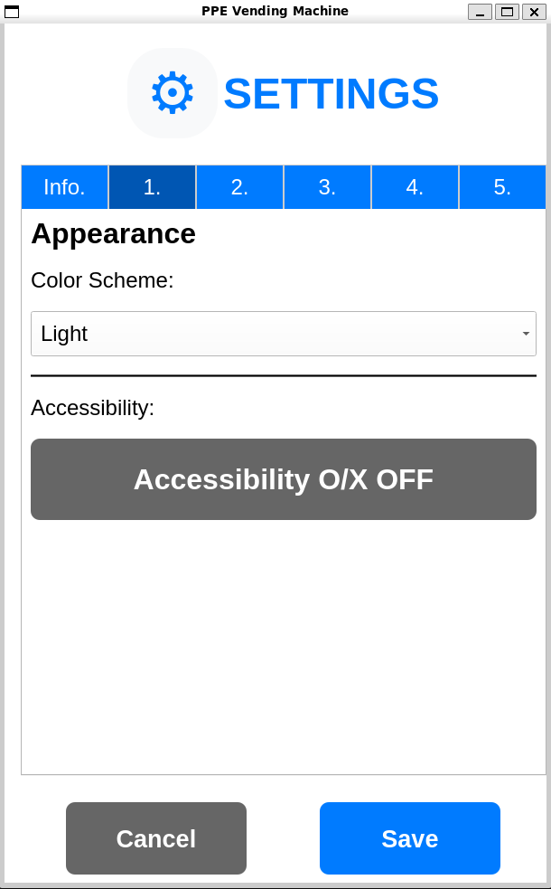
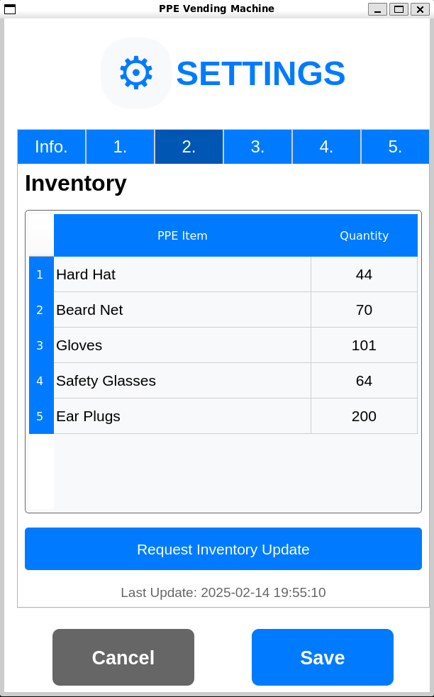
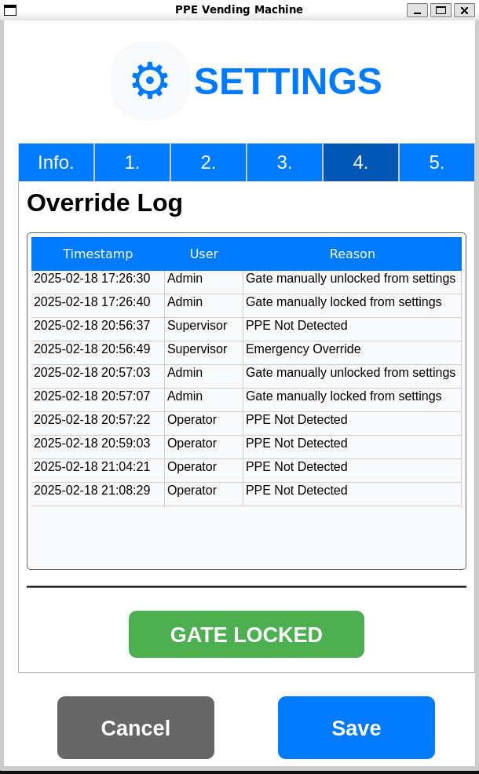
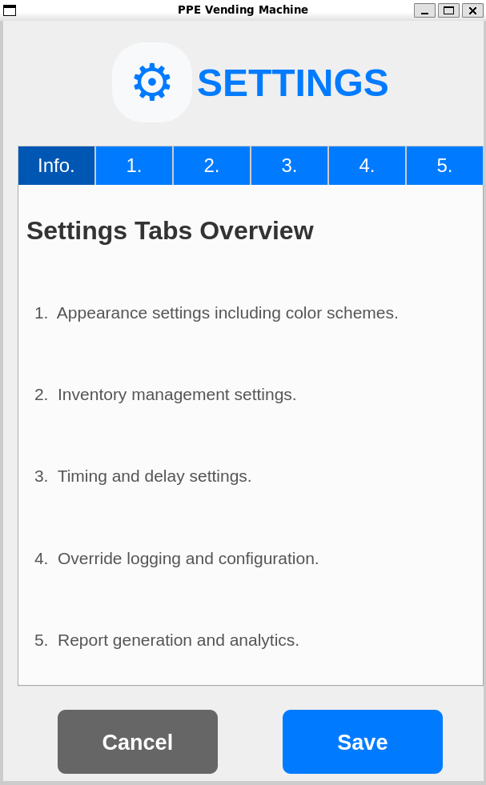
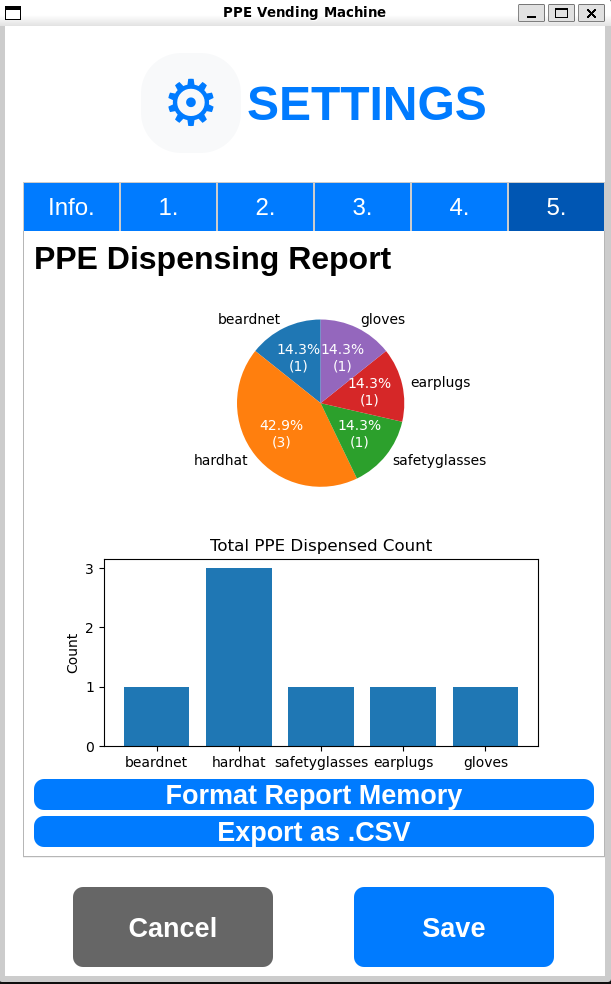

# GUI Package for PPE Vending Machine


A ROS2 package containing a PyQt5-based graphical user interface for controlling and monitoring a PPE (Personal Protective Equipment) vending machine.

<details>
<summary><span style="font-size: 1.2em;">Table of Contents</span></summary>

- [Features](#features)
  - [Core Features](#core-features)
  - [Future Features (Planned)](#future-features-planned)
  - [Future Next Steps](#future-next-steps)
- [Update Changelog](#update-changelog)
- [Dependencies](#dependencies)
- [Installation](#installation)
- [Usage](#usage)
  - [Provided Nodes](#provided-nodes)
  - [Provided Launch Files](#provided-launch-files)
- [ROS2 Topics](#ros2-topics)
  - [Subscribed Topics](#subscribed-topics)
  - [Published Topics](#published-topics)
- [Development](#development)
  - [Using as a Submodule](#using-as-a-submodule)
  - [Building for Development](#building-for-development)
- [Screenshots](#screenshots)
- [Author](#author)

</details>

## Features

### Core Features
- **Real-time PPE Detection**: Monitor PPE detection status in real-time for immediate feedback.
- **Automated Safety Gate Control**: Implement logic for automatic control of the safety gate.
- **ROS2 Integration**: Seamlessly interface with vending machine hardware and computer vision models using ROS2.
- **Safety Gate Override System**: Allow the safety gate to be overriden provided user and reason information.
- **Simulation Support**: Test nodes are provided to simulate and test the GUI for demonstrations.
- **Touchscreen Friendly**: GUI is developed with a touchscreen in mind with large touch targets and clear text labels.
- **ESP32 Safety Gate Controller**: A ESP32 microcontroller is used to control the safety gate.
- **Inventory Management**: Inventory is managed with a JSON file and can be viewed live from the GUI.
- **Theme Support**: The GUI supports a dark theme and a light theme.
- **Accessibility Features**: The GUI supports a toggle for O/X status indicators, for users with visual impairments.
- **Analytical Reporting**: Generate insightful reports with visualizations of PPE dispensing activities, including pie and bar charts, to aid in inventory management and decision-making, a ros bag file is also recorded for later analysis using services such as AWS S3.

### Future Features (Planned)
- **Camera Feed**: A camera feed will be added to the GUI to display the PPE detection in real-time.

### Future Next Steps
- **User Authentication**: User authentication will be added to the GUI to allow for user specific settings and permissions.

### Update Changelog
For a detailed list of changes, bug fixes, and new features, please refer to the [CHANGELOG](docs/additional_documents/CHANGELOG.md).

## Dependencies

- ROS2 Humble
- Python 3.10+
- PyQt5 5.15+
- rclpy
- std_msgs

## Installation

1. Create a ROS2 workspace (if you don't have one):
    ```bash
    mkdir -p ~/ros2_ws/src
    cd ~/ros2_ws
    ```

2. Clone this package:
    ```bash
    cd src
    git clone https://github.com/ckyb63/ppe_gui_package.git
    ```

3. Install dependencies using `rosdep`:
    ```bash
    cd ~/ros2_ws
    rosdep install --from-paths src --ignore-src -r -y
    ```

4. Install additional dependencies:
    ```bash
    sudo apt update
    sudo apt install python3-pyqt5
    ```

5. Build and source the workspace:
    ```bash
    cd ~/ros2_ws
    colcon build
    source install/setup.bash
    ```

6. Run the GUI:
    ```bash
    ros2 launch gui_package main_ppe_gui.launch.py
    ```

## Usage

### Provided Nodes

```bash
# Run the main GUI
main_ppe_gui

# Run the dummy inventory publisher which simulates the inventory level of the PPE vending machine
dummy_inventory

# Run the dummy PPE dispenser which simulates random PPE detection
dummy_ppe

# For running with Demo Gate hardware (ESP32 connected with USB over Serial)
safety_gate_controller

# For recording the dispense bag
record_dispense_bag
```

### Provided Launch Files

```bash
# Launch the main GUI with the gate controller and ros bag recording node
main_ppe_gui.launch.py

# Launch the dummy nodes together
dummy_nodes.launch.py
```

## ROS2 Topics

### Subscribed Topics
- `ppe_status` (std_msgs/String): Receives PPE detection status
  - Format: "hardhat:true, beardnet:false, gloves:true, glasses:true, earplugs:false"
- `ppeInventoryStatus` (std_msgs/String): Receives inventory status updates
  - Format: JSON string with inventory levels

### Published Topics
- `pleaseDispense` (std_msgs/String): Sends dispense requests
  - Values: "hardhat", "beardnet", "gloves", "glasses", "earplugs", "OVERRIDE"
- `gate` (std_msgs/Bool): Controls safety gate status
  - true = locked, false = unlocked
- `ppeInventory` (std_msgs/String): Sends inventory update requests
  - Value: "request"

## Development

### Using as a Submodule

If you want to include this PPE GUI package as a submodule in your main repository, follow these steps:

1. **Add the Submodule**: Navigate to your main repository's root directory (or straight to the src folder) and run the following command to add this repository as a submodule:
   ```bash
   git submodule add https://github.com/ckyb63/ppe_gui_package.git "your_workspace"/src/ppe_gui_package
   ```

2. **Initialize and Update Submodules**: After cloning your main repository, initialize and update the submodules with the following commands:
   ```bash
   git submodule init
   git submodule update
   ```
Then you can build the workspace and run ROS 2 as normal.


### Building for Development
```bash
cd "your_workspace"
colcon build --packages-select gui_package --symlink-install
```

## Screenshots

<details>
<summary>Main Interface</summary>

<table>
<tr>
    <td width="50%"></td>
    <td width="50%"></td>
</tr>
<tr>
    <td><em>Standard interface with PPE status indicators</em></td>
    <td><em>Dark theme with accessibility features</em></td>
</tr>
</table>

</details>

<details>
<summary>Override System</summary>


*Enhanced override dialog with user authentication and reason tracking*

</details>

<details>
<summary>Settings Interface</summary>

<table>
<tr>
    <td width="50%"></td>
    <td width="50%"></td>
</tr>
<tr>
    <td><em>Main settings configuration panel</em></td>
    <td><em>Inventory management settings</em></td>
</tr>
</table>

<table>
<tr>
    <td width="50%"></td>
    <td width="50%"></td>
</tr>
<tr>
    <td><em>System timing and delay settings</em></td>
    <td><em>Override logging and configuration</em></td>
</tr>
</table>

<table>
<tr>
    <td width="50%"></td>
    <td width="50%"></td>
</tr>
<tr>
    <td><em>Settings tab Info</em></td>
    <td><em>Dispensing report and analytics</em></td>
</tr>
</table>

</details>

<details>
<summary>Help Documentation</summary>


*Comprehensive user help guide with feature explanations*

</details>

## Author

- Max Chen
- Email: ckyb63@gmail.com