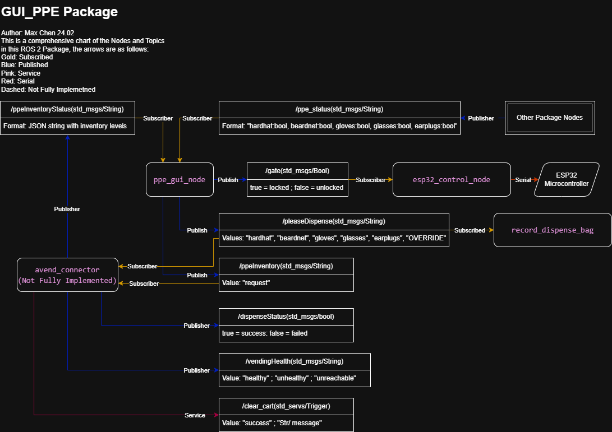

# GUI Package for PPE Vending Machine


<details>
<summary>Table of Contents</summary>

- [Introduction](#introduction)
- [Features](#features)
- [Update Changelog](#update-changelog)
- [Dependencies](#dependencies)
- [Installation](#installation)
- [Usage](#usage)
- [Topics](#topics)
- [Screenshots](#screenshots)
- [Author](#author)

</details>

## Introduction

The **PPE Vending Machine GUI Package** is a ROS2-based application designed to provide an intuitive graphical user interface (GUI) for controlling and monitoring Personal Protective Equipment (PPE) vending machines. Built with PyQt5, this package enables real-time interaction with the vending machine hardware, allowing users to efficiently manage PPE dispensing, monitor inventory levels, and ensure safety compliance. The GUI is tailored for ease of use, featuring touchscreen compatibility and accessibility options to accommodate a wide range of users.

## Features

#### Detection and Control
- **Real-time PPE Detection**: Monitor PPE detection status in real-time for immediate feedback.
- **Automated Safety Gate Control**: Implement logic for automatic control of the safety gate.
- **Safety Gate Override System**: Allow the safety gate to be overridden provided user and reason information.
- **PPE Dispensing System**: Send PPE dispense requests to the vending machine hardware based on GUI inputs.

#### Integration and Simulation
- **ROS2 Integration**: Seamlessly interface with vending machine hardware and computer vision models using ROS2.
- **Simulation Support**: Test nodes are provided to simulate and test the GUI for demonstrations.

#### User Experience
- **Touchscreen Friendly**: GUI is developed with a touchscreen in mind with large touch targets and clear text labels.
- **Theme Support**: The GUI supports a dark theme and a light theme.
- **Accessibility Features**: The GUI supports a toggle for O/X status indicators, for users with visual impairments.

#### Management and Reporting
- **ESP32 Safety Gate Controller**: An ESP32 microcontroller is used to control the safety gate.
- **Inventory Management**: Inventory is managed with a JSON file and can be viewed live from the GUI.
- **Analytical Reporting**: Generate insightful reports with visualizations of PPE dispensing activities, including pie and bar charts, to aid in inventory management and decision-making. A ROS bag file is also recorded for later analysis using services such as AWS S3.

### Update Changelog
For a detailed list of changes, bug fixes, new features, and the [Latest Release](CHANGELOG.md#latest-release), please refer to the [CHANGELOG](CHANGELOG.md).

## Dependencies

- ROS2 Humble
- Python 3.10+
- PyQt5 5.15+

## Installation

1. Create a ROS2 workspace (if you don't have one):
    ```bash
    mkdir -p ~/ros2_ws/src
    cd ~/ros2_ws
    ```

2. Clone this package:
    ```bash
    cd src
    git clone https://github.com/ckyb63/ppe_gui_package.git
    ```

3. Install dependencies using `rosdep`:
    ```bash
    cd ~/ros2_ws
    rosdep install --from-paths src --ignore-src -r -y
    ```

4. Install additional dependencies:
    ```bash
    sudo apt update
    sudo apt install python3-pyqt5
    ```

5. Build and source the workspace:
    ```bash
    cd ~/ros2_ws
    colcon build --packages-select gui_package --symlink-install
    source install/setup.bash
    ```

6. Run the GUI:
    ```bash
    ros2 launch gui_package main_ppe_gui.launch.py
    ```

## Usage

### Provided Nodes for use with ```ros2 run```

```bash
# Run the main GUI which is a PyQt5-based GUI for controlling and monitoring the PPE vending machine
main_ppe_gui

# Run the dummy inventory publisher which simulates the inventory level of the PPE vending machine
dummy_inventory

# Run the dummy PPE dispenser which simulates random PPE detection
dummy_ppe

# For running with Demo Gate hardware (ESP32 connected with USB over Serial)
safety_gate_controller

# For recording the dispense bag
record_dispense_bag
```

### Provided Launch Files for use with ```ros2 launch```

```bash
# Launch the main GUI with the gate controller and ros bag recording node
main_ppe_gui.launch.py

# Launch the dummy nodes together
dummy_nodes.launch.py
```

## Topics

### Subscribed Topics
- `ppe_status` (std_msgs/String): Receives PPE detection status
  - Format: "hardhat:true, beardnet:false, gloves:true, glasses:true, earplugs:false"

- `ppeInventoryStatus` (std_msgs/String): Receives inventory status updates
  - Format: JSON string with inventory levels

### Published Topics
- `pleaseDispense` (std_msgs/String): Sends dispense requests
  - Values: "hardhat", "beardnet", "gloves", "glasses", "earplugs", "OVERRIDE"

- `gate` (std_msgs/Bool): Controls safety gate status
  - true = locked, false = unlocked

- `ppeInventory` (std_msgs/String): Sends inventory update requests
  - Value: "request"

## Node and Topic Relationships

The following chart illustrates the current relationship between the nodes and topics in the PPE Vending Machine GUI Package:



This chart provides a visual representation of how the various nodes communicate through topics which is helpful for understanding what this package is about.

## Screenshots

<details>
<summary>Main Interface</summary>

<table>
<tr>
    <td width="50%"></td>
    <td width="50%"></td>
</tr>
<tr>
    <td><em>Standard interface with PPE status indicators</em></td>
    <td><em>Dark theme with accessibility features</em></td>
</tr>
</table>

</details>

<details>
<summary>Safety Gate Override</summary>


*Enhanced override page with user authentication and reason tracking*

</details>

<details>
<summary>Settings Interface</summary>

<table>
<tr>
    <td width="50%"></td>
    <td width="50%"></td>
</tr>
<tr>
    <td><em>Main settings configuration panel</em></td>
    <td><em>Inventory management settings</em></td>
</tr>
</table>

<table>
<tr>
    <td width="50%"></td>
    <td width="50%"></td>
</tr>
<tr>
    <td><em>System timing and delay settings</em></td>
    <td><em>Override logging and configuration</em></td>
</tr>
</table>

<table>
<tr>
    <td width="50%"></td>
    <td width="50%"></td>
</tr>
<tr>
    <td><em>Settings tab Info</em></td>
    <td><em>Dispensing report and analytics</em></td>
</tr>
</table>

</details>

<details>
<summary>Integrated User Help Guide</summary>


*Comprehensive user help guide with feature explanations*

</details>

## Author

- Max Chen
- Email: ckyb63@gmail.com